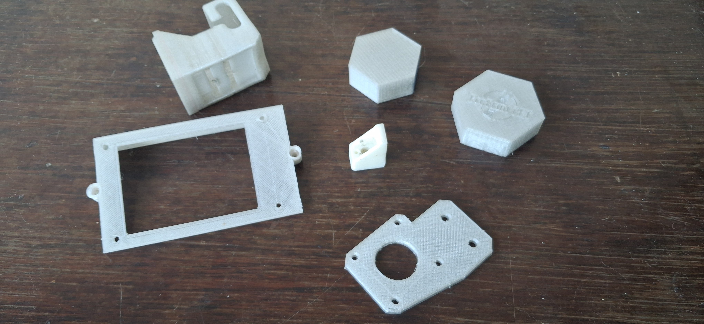
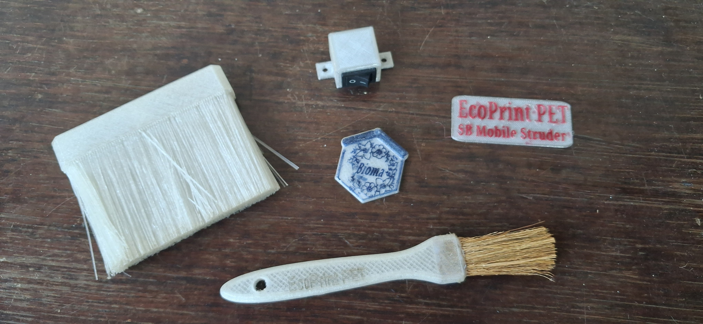

# Pullstruder: Circular Economy Technology for the Amazon Rainforest

## Project Vision
This technology is designed to transform plastic waste (PET) into valuable resources for isolated communities. The Pullstruder machine converts plastic bottles into high-quality filament for 3D printing and local manufacturing, fostering sustainability and independence.

## Key Technical Features
- **Modular Ecosystem:** A versatile range of solutions, from standard filament production (spooling) to advanced direct systems.
- **Direct Plug & Play:** A specialized device that can be mounted directly onto 3D printers for a seamless "waste-to-object" process.
- **Low-Cost Infrastructure:** Engineered to be affordable and accessible in low-resource settings.
- **Resilience & Maintenance:** All wear-and-tear components are designed to be locally replaceable via 3D printing (Distributed Manufacturing).
- ## Video Demonstrations / Demonstrações em 

<table>
  <tr>
    <td align="center" width="33%">
      
<b>Automated PET Recycling System</b>

      
    </td>
    <td align="center" width="33%">
      
<b>Mobile Recycling Unit for Remote Areas</b>

      
    </td>
    <td align="center" width="33%">
      
<b>Precision Engineering & Mechanical Parts</b>

      
    </td>
  </tr>
  
  <tr>
    <td align="center" width="33%">
      
<b>Plug & Play Direct Printing: Universal PET Upgrade</b>

      
    </td>
    <td align="center" width="33%">
      
<b>Sustainable Impact: Transforming Waste into Value</b>

      
    </td>
    <td align="center" width="33%">
      
<b>From Waste to Everyday Solutions</b>

      
    </td>
  </tr>
</table>

*Click on the images to watch the videos on YouTube / Clique nas imagens para assistir aos vídeos no YouTube.*

---

## Intellectual Property & Licensing
This project is protected under the **Creative Commons Attribution-NonCommercial (CC BY-NC)** license. 
The core technical files (STL/CAD) are kept secure to prevent unauthorized commercial exploitation. However, these files are shared with partner communities during the implementation phase to guarantee technical autonomy and full system repairability.

## Institutional Partnership
Developed in collaboration with [Forest-Metrics Laboratory](https://github.com/Bia-florestal/Forest-Metrics/tree/main).

## Contact
For technical inquiries or institutional partnerships, please contact the developer via GitHub.

---

# Pullstruder: Tecnologia de Economia Circular para a Floresta Amazônica

## Visão do Projeto
Esta tecnologia foi desenvolvida para transformar resíduos plásticos (PET) em recursos valiosos para comunidades isoladas. A máquina Pullstruder converte garrafas plásticas em filamento de alta qualidade para impressão 3D e fabricação local, promovendo sustentabilidade e independência.

## Principais Características Técnicas
- **Ecossistema Modular:** Uma gama versátil de soluções, desde a produção de filamento padrão (bobinagem) até sistemas diretos avançados.
- **Direct Plug & Play:** Um dispositivo especializado que pode ser montado diretamente em impressoras 3D para um processo contínuo de "resíduo para objeto".
- **Infraestrutura de Baixo Custo:** Projetada para ser acessível em contextos de poucos recursos.
- **Resiliência e Manutenção:** Todos os componentes sujeitos a desgaste foram projetados para serem substituídos localmente via impressão 3D (Fabricação Distribuída).

## Propriedade Intelectual e Licenciamento
Este projeto está protegido sob a licença **Creative Commons Attribution-NonCommercial (CC BY-NC)**.
Os arquivos técnicos principais (STL/CAD) são mantidos em segurança para evitar exploração comercial não autorizada. No entanto, esses arquivos são compartilhados com as comunidades parceiras durante a fase de implementação para garantir autonomia técnica e reparabilidade total do sistema.

## Parceiro Institucional
Desenvolvido em colaboração com o [Laboratório Forest-Metrics](https://github.com/Bia-florestal/Forest-Metrics/tree/main).

## Contato
Para consultas técnicas ou parcerias institucionais, entre em contato com o desenvolvedor via GitHub.
